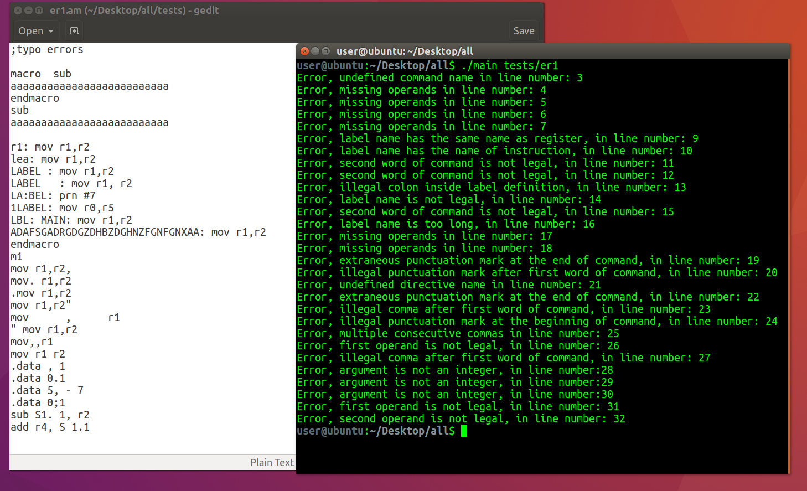
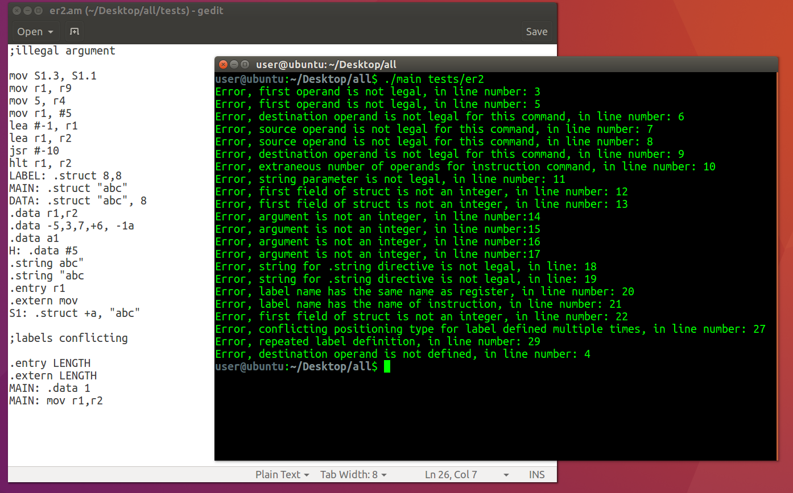

# Assembler
This assembler programm translates instructions into binary machine code and then into unique base 32 code.

## General Info
Final project of the course 'Systems programming laboratory' in The Open University of Israel.

## Technologies
Project is created with ANSI C language on Ubuntu 16.04 operating system.

## Input files
Source file of instructions with extension ".as", for example ps.as.

## Output files
There are at most 4 output files:
* ".am" file of instructions after expanding macro statements.
* ".ob" file contains two columns table with unique base 32 code representation. First two numbers of table are counters of instructions and directives translated into unique base 32 code. Other rows contain: list of instruction's and then directive's  address and code.
* ".ext" optional file, created if only there are external labels defined in source file. Contains name of external label and it's 32 base address.
* ".ent" optional file, created if only there are entry labels defined in source file. Contains name of entry label and it's 32 base address.

## More details about running
Program can receive multiple ".as" files as an input, but will refer to each file separately.
If there is error in line of instruction, program will print error type into terminal and continue execution. Line that contains an error will be ignored in further steps.  

Binary machine code in this program is memory word that contains 10 bits (4 bits for opcode, 2 bits for source operand, 2 bits for destination operand, 2 bits for encoding type). Each line can be represented by 1 to 5 memory words. This intermediate step is not outputted and directly translated into base 32 code. 

## Running steps
* Preprocessor: 

    Receives ".as" file and creates ".am" after expanding macro statements. At this step program doesn't check errors inside instructions.
* First step:

    Read, save instructions and their parameters, separate by type: command or directive (create symbol tables). Check different errors like typo's, wrong command names, wrong parameters etc.
* Second step: 

    Check label definitions and types. Handling possible errors in labels list (error for example: label is defined as entry and extern in the same source file). 
* Third step: 

    Keep track of location counter, translate instructions and output into files.

## Error types examples
### typo errors

### logic errors

